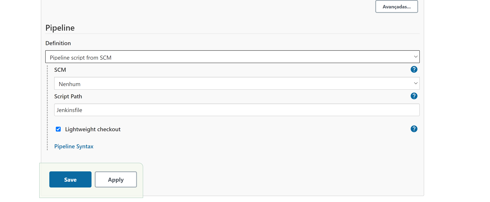
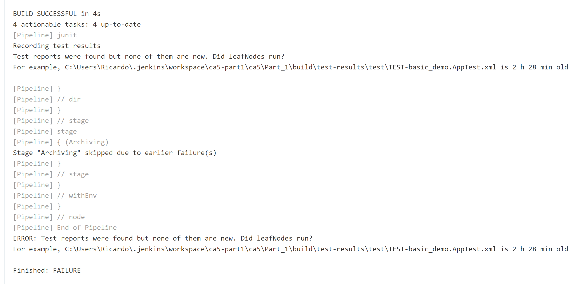

# Class Assignment 5 - Continuous Integration and Delivery

# Jenkins

Hello, old friend! Here we are again in the best place to find tutorials, my Readme files.

Today we'll be talking about Continuous Integration and Delivery using Jenkins.

For this Part of the CA5, the goal is to pratice the utilization of the Jenkins tool.

We'll recur to an already existing project in our repository.

# 1. Create a Pipeline

For this step we'll be using the example that was provided by the teacher in the first Jenkins lecture.

**1.1**  Install Jenkins in your computer and run it. You can use the official page to guide you
- https://www.jenkins.io/doc/book/installing/

**1.2** After installing and having everything configured, open "your" Jenkins and in the main page select "new item"


**1.3** Name it and select Pipeline and click "Ok"


**1.4** Scroll to the bottom and paste the example the teacher has provided in the first CI/CD lecture and Save.

````groovy
pipeline {
    agent any

    stages {
        stage('Checkout') {
            steps {
                echo 'Checking out...'
                git 'https://bitbucket.org/luisnogueira/gradle_basic_demo'
            }
        }
        stage('Build') {
            steps {
                echo 'Building...'
                sh './gradlew clean build'
            }
        }
        stage('Archiving') {
            steps {
                echo 'Archiving...'
                archiveArtifacts 'build/distributions/*'
            }
        }
    }
}
````


### Now, let's do the same but applying our own work!

**1.6** So let's create a new item (Pipeline) in Jenkins, just like before.

**1.7** When you reach the following menu select Pipeline and change it to "Pipeline Script from SCM"



This will make us run the Pipeline from our own repository.

Introduce the correct URL and guarantee that your Jenkinsfile is in the correct url.


I've had some issues when I placed the Jenkinsfile in a different folder than the repository's root folder.


It kept saying that the Jenkinsfile could not be found. I've since changed the Jenkinsfile to the repository root and
had no more issues with Jenkins not finding the Jenkinsfile.

Now, press Save.


# 2. Edit the Jenkinsfile

**2.1** In your local repository, create a new file and for now let's paste a very similar code to the previous example:

````groovy
pipeline {
    agent any

    stages {
        stage('Checkout') {
            steps {
                echo 'Checking out...'
                git 'https://bitbucket.org/Batista_Ricardo/devops-20-21/src/master/ca5/Part_1/'
            }
        }
        stage('Build') {
            steps {
                echo 'Building...'
                dir('ca5/Part_1/') {
                    sh './gradlew clean build'
                }
            }
        }
        stage('Archiving') {
            steps {
                echo 'Archiving...'
                archiveArtifacts 'ca5/Part_1/build/distributions/*'
            }
        }
    }
}
````

### Some notes regarding this code:

- My repository is public so we don't need to create credentials in order to allow Jenkins to connect to the repository.
  There is an example of how to do it in the first _Devops_ lecture of CI/CD.


- I've had lot's of failed builds in previous attempts because Jenkins could not find the _gradlew_.  
  In order to solve this I tried the _cd ca5/Part_1/_ shell command but it didn't work. After a few failed attempts and
  thanks to my group member **Ricardo Nogueira**, I found out there's a different syntax _dir ('ca5/Part1/') {.....}_ as
  you can see in the code.

# 2. Save the changes and commit and push your Jenkinsfile to your repository.

# 3. Run the Pipeline

**3.1** Go to the Jenkins Dashboard, select your Pipeline and press "Build Now" in order to test the Pipeline.

It should now compile and run through all the Pipeline:


# 4. Congratulations! Now we now it is working. But there is still work to do! Now we need to adapt the Jenkinsfile in order to complete the CA5-Part1!

**4.1** One of the required changes is the gradle build task. Since we have a dedicated stage for testing, we'll need to
change the Build stage to an Assemble stage using _gradle assemble_ in order to not run the tests at that stage.

**4.2** We'll then add a test stage running the unit tests and publishing them in Jenkins.

The final version of Jenkinsfile should look like this:

````groovy
pipeline {
    agent any

    stages {
        stage('Checkout') {
            steps {
                echo 'Checking out...'
                git 'https://bitbucket.org/Batista_Ricardo/devops-20-21/src/master/ca5/Part_1/'
            }
        }
        stage('Assemble') {
            steps {
                echo 'Assembling...'
                dir('ca5/Part_1/') {
                    sh './gradlew assemble'
                }
            }
        }
        stage('Tests') {
            steps {
                echo 'Testing...'
                dir('ca5/Part_1/') {
                    sh './gradlew clean test'
                    junit '**/TEST-basic_demo.AppTest.xml'
                }
            }
        }
        stage('Archiving') {
            steps {
                echo 'Archiving...'
                archiveArtifacts 'ca5/Part_1/build/distributions/*'
            }
        }
    }
}
````

Regarding the _Tests_ stage I have to say that the junit '...' line was a tough one...Once again I had one of those _
Abandon all hope ye who enter here_:


I went to the _Pipeline Syntax_ Snippet Generator and created a script for the junit "task". But no matter the path I
placed in there there was always an error:


I iterated, looked online, went to _Minas Tirith's_ library, had tea with the Queen of England, rode horses with Genghis
Khan, visited the Pope and even discussed with a great philosopher called Sócrates (Do not mistake with the one from
Ancient Greece. This Sócrates I'm speaking really knows how to solve any problems **wink** **wink**. People even give
him money just because he's such a good friend!)

And I realized that between my head and a bell, there is not much difference.

Some say that if I exchanged heads with a donkey, the donkey would be losing after the exchange...

So, an epiphany hit me! I had to look in the .jenkins folder and go to my workspace in order to see the build products (
Because the build would only fail in finding the test report):


I searched through my jenkins workspace _et voilá, croissant_!


So, I changed the file name and guess what?

Didn't work...........



It's time for:


### Proposed solution? Apply PDD (Pedreiro Driven Design)

Let's use this Design solution and delete the folder on our Jenkins workspace.

Folder deleted, trying to build again aaaaaaaaand it fails again...


Something something your pc is on fire, etc etc.


So, I deleted some files from the disk in order to gain some space (It was indeed with low free space).

Then we run again and it works =).


I ran it one more time and the issue of Tests not having any new information and breaking the build appeared. Which
makes sense.

So, in order to fix this I'm going to change the Jenkinsfile to execute a clean test run everytime the _test_ task is
executed!

````groovy
stage('Tests') {
    steps {
        echo 'Testing...'
        dir('ca5/Part_1/') {
            sh './gradlew clean test'
            junit '**/TEST-basic_demo.AppTest.xml'
        }
    }
}
````

And has it was expected, once a problem is solved, another one appears...

Now Jenkins doesn't find the _build/distibutions_.

After some though and iterations the clean solution solves the test issue but erases some build products.

So, in order to solve this issue I exchanged the order of the stages.

Now, it archives first and tests later:

````groovy
pipeline {
    agent any

    stages {
        stage('Checkout') {
            steps {
                echo 'Checking out...'
                git 'https://bitbucket.org/Batista_Ricardo/devops-20-21/src/master/ca5/Part_1/'
            }
        }
        stage('Assemble') {
            steps {
                echo 'Assembling...'
                dir('ca5/Part_1/') {
                    sh './gradlew assemble'
                }
            }
        }
        stage('Archiving') {
            steps {
                echo 'Archiving...'
                archiveArtifacts 'ca5/Part_1/build/distributions/*'
            }
        }
        stage('Tests') {
            steps {
                echo 'Testing...'
                dir('ca5/Part_1/') {
                    sh './gradlew clean test'
                    junit '**/TEST-basic_demo.AppTest.xml'
                }
            }
        }
    }
}
````

It may be a little PDD solution, but it builds successfully several times in a row:


# EDIT: Actually, there is a simpler way to do it! We could use _
clean_ in the assemble stage! This way, there is no need to change the test and archiving stages!

## Here's how it should look like:

````groovy
pipeline {
    agent any

    stages {
        stage('Checkout') {
            steps {
                echo 'Checking out...'
                git 'https://bitbucket.org/Batista_Ricardo/devops-20-21/src/master/ca5/Part_1/'
            }
        }
        stage('Assemble') {
            steps {
                echo 'Assembling...'
                dir('ca5/Part_1/') {
                    sh './gradlew clean assemble'
                }
            }
        }

        stage('Tests') {
            steps {
                echo 'Testing...'
                dir('ca5/Part_1/') {
                    sh './gradlew test'
                    junit '**/TEST-basic_demo.AppTest.xml'
                }
            }
        }
        stage('Archiving') {
            steps {
                echo 'Archiving...'
                archiveArtifacts 'ca5/Part_1/build/distributions/*'
            }
        }
    }
}
````

And it works!


# So, first part is through! If it gave this much trouble and it's the easy part I can't wait for the difficult one 
(_Please send help..._)

