# Class Assignment 5 Part 2 - Continuous Integration and Delivery

# Jenkins

Long time, no see! In this part of the assignment we'll continue to work with Jenkins.

This time we'll be doing it with a Springboot application from a previous assignment.

# 1. Create a new Pipeline in Jenkins.

Just like the previous tutorial, run Jenkins on your computer and add a new job and create a Pipeline just like before.

# 2. Configure the Jenkinsfile script

### 2.1. According to the CA5-PART2 guidelines our Jenkins script should have the following steps:

**Checkout**  
**Assemble**   
**Test**  
**Javadoc**  
**Archive**  
**Publish Image**

Let's go the Jenkinsfile and configure each of these steps.

We can copy some of the previously used Jenkinsfile from CA5-PART1.

Let's use this to initially test the Pipeline:

````groovy
pipeline {
    agent any

    stages {
        stage('Checkout') {
            steps {
                echo 'Checking out...'
                git 'https://bitbucket.org/Batista_Ricardo/devops-20-21/src/master/ca5/Part_2/'
            }
        }
        stage('Assemble') {
            steps {
                echo 'Assembling...'
                dir('ca5/Part_2/') {
                    sh './gradlew clean assemble'
                }
            }
        }

        stage('Tests') {
            steps {
                echo 'Testing...'
                dir('ca5/Part_2/') {
                    sh './gradlew test'
                    junit '**/TEST-basic_demo.AppTest.xml'
                }
            }
        }

        stage('Archiving') {
            steps {
                echo 'Archiving...'
                archiveArtifacts 'ca5/Part_2/build/distributions/*'
            }
        }
    }

}

````

We made some small changes regarding Part2 folder. (The first attempt of build failed due to missing brackets. Ctrl+C
and Ctrl+V is a curse!)

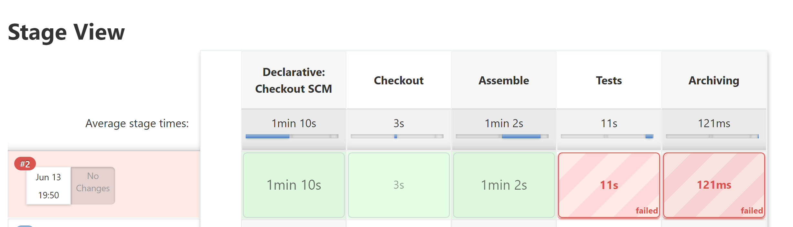

Almost! Something went wrong with the test report. I believe it's the location of the file. Let's have a look at that.

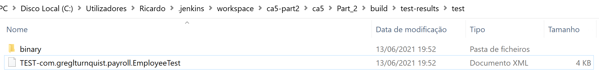

As I suspected (but failed to predict...) the name of the test report file is not a match!

Once again, copy and paste has mysterious ways!

Let's change that in the Jenkinsfile:

````groovy
stage('Tests') {
    steps {
        echo 'Testing...'
        dir('ca5/Part_2/') {
            sh './gradlew test'
            junit '**/TEST-com.greglturnquist.payroll.EmployeeTest.xml'
        }
    }
}
````

Now let's look at the console log for the Archiving stage:

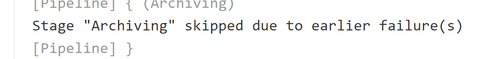

Apparently Archive only failed due to the previous test fail.

Let's try another build (But first, commit and push the changes to the remote repository!)

Once again, almost:

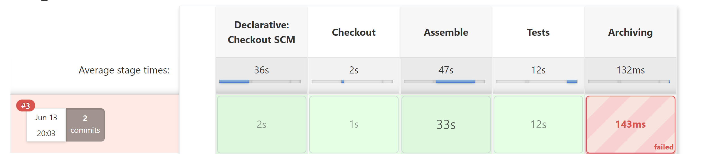

Console output:

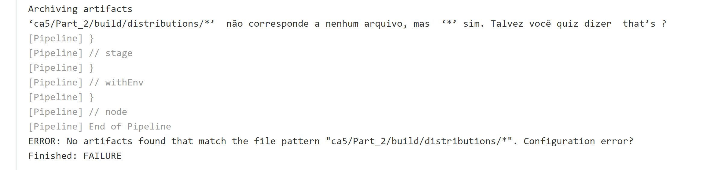

Once again, I'm feeling as smart as a golf ball!

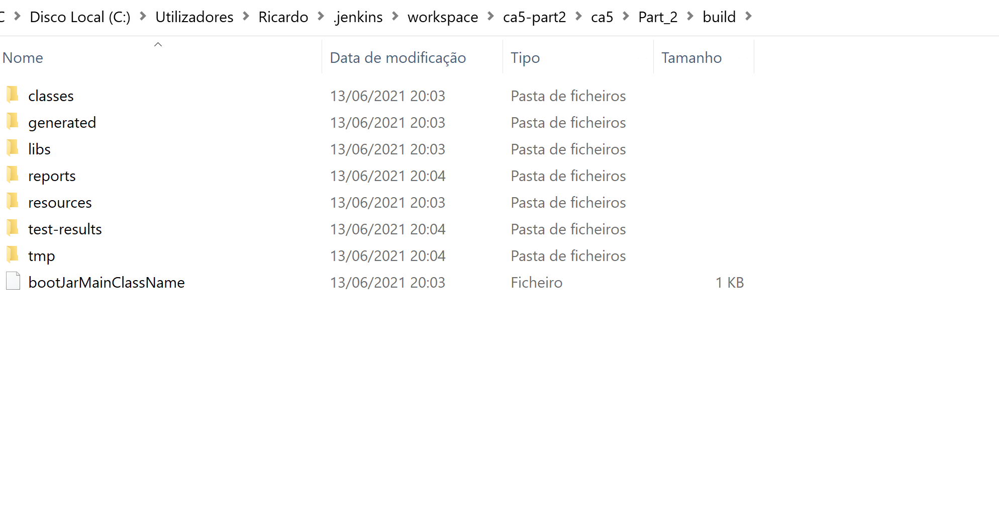

There's in fact no path such as the one in the Jenkinsfile.

Sometimes I believe I'm a living proof that Darwin was not right regarding survival of the fittest.


I went and look for any war file in the directory but to my surprise I've found none.

After some searching and talking with my group members the conclusion was, there is no war plugin in the build.gradle
file for this previous class assignment.

Only in class assignment 3 we've utilized the war plugin in build.gradle.

So, in order to fix this I added _'id war'_ to the plugins section of the _build.gradle_ file.
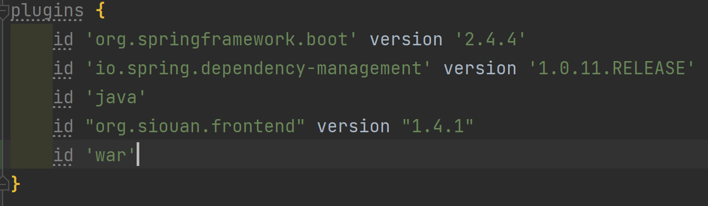

Now everything should be in order!

Let's try another build on Jenkins.

It failed! Once again in the Archiving Stage. Some Bazel flashbacks are returning...

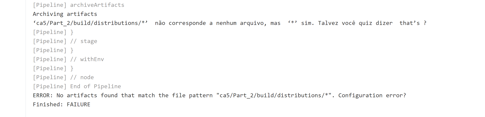

So, it's the path! Let's fix the path to the correct one.

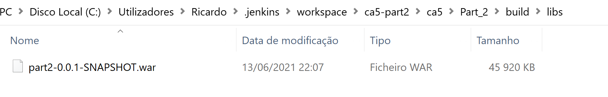

Just update the Jenkinsfile:

````groovy
stage('Archiving') {
    steps {
        echo 'Archiving...'
        archiveArtifacts 'ca5/Part_2/build/libs/*'
    }
}
````

So, commit and push and...

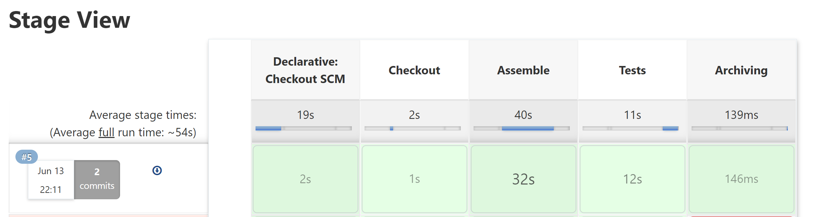


It's working. Now let's look at the missing stages:

**Javadoc** and **Publish Image** using Docker.

### 2.2 Javadoc stage

Let's use the Jenkins resources to look for Javadoc-type task.

I've searched through the Syntax Pipeline but there is no previously defined Javadoc example.

After a quick search I've found that we need to install the Javadoc plugin on Jenkins.

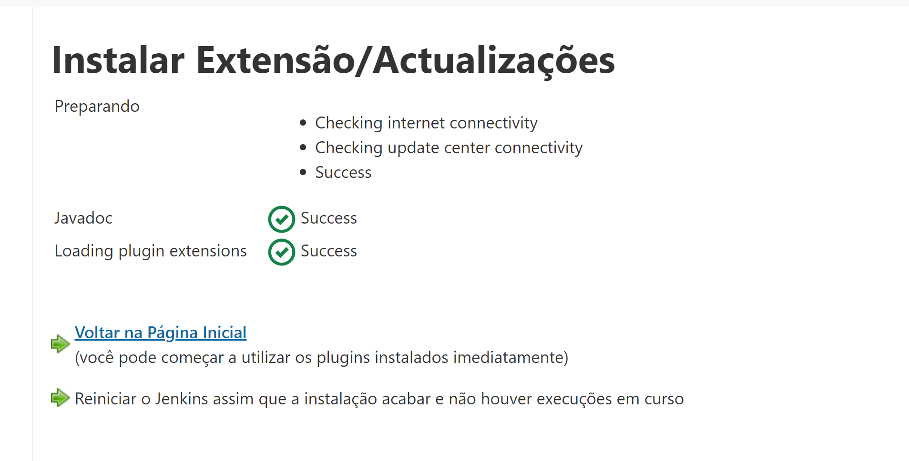

Since we also need to publish results using html, install the _html publisher_ plugin too

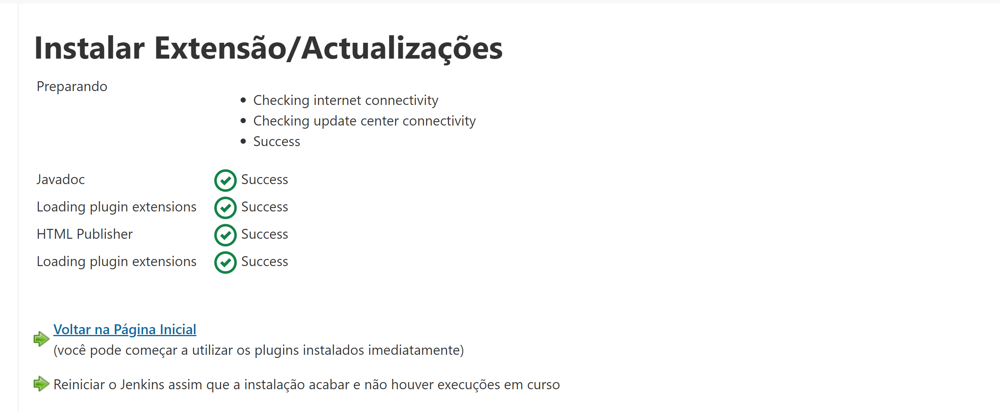

After installing the plugin, let's create a pipeline script using Snippet Generator to publish Javadoc:

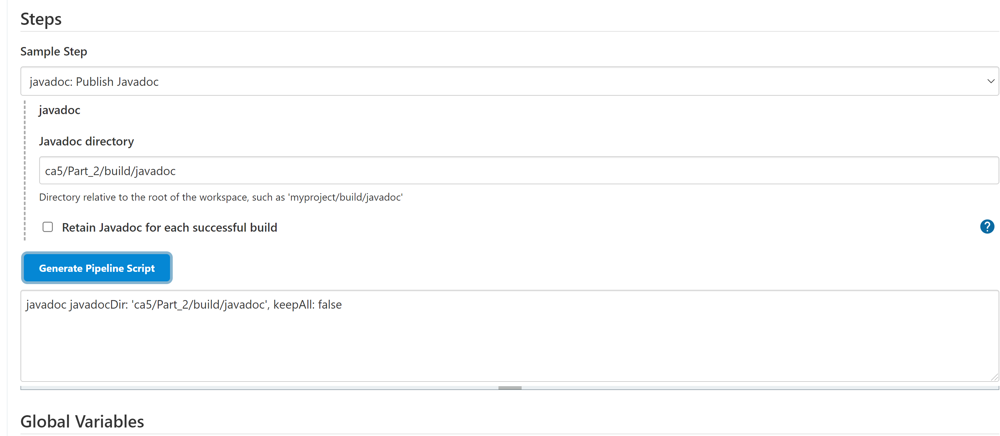

Let's add this to the Jenkinsfile. But first we must generate the Javadoc itself.

For that we're going to use the gradle command _./gradlew javadoc_

So, this new stage should look like this:

````groovy
stage('Javadoc') {
    steps {
        echo 'Generating Javadoc'
        dir('ca5/Part_2/') {
            sh './gradlew javadoc'
            javadoc javadocDir: 'ca5/Part_2/build/javadoc', keepAll: false
        }
    }
}
````

Let's build it......It failed...

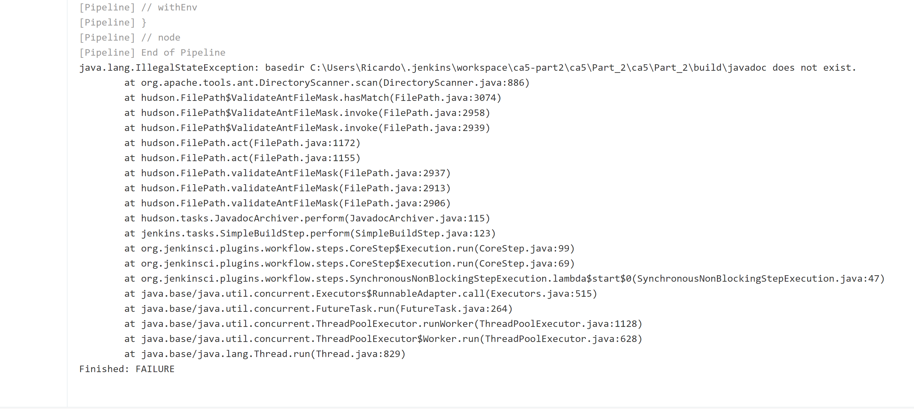

Seems like another directory mistake...

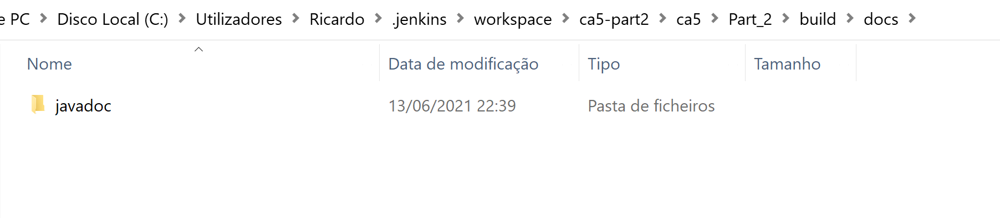

There it is...a missing folder in the path. Updated the path and let's try again:

````groovy
        stage('Javadoc') {
    steps{
        echo 'Generating Javadoc'
        dir('ca5/Part_2/'){
            sh './gradlew javadoc'
            javadoc javadocDir: 'build/docs/javadoc', keepAll: false
        }
    }
}
````

After a few hickups with the path, there it is:

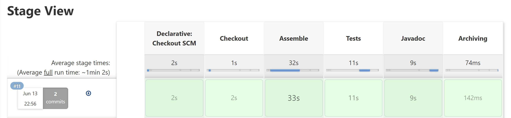

And the generated Javadoc:

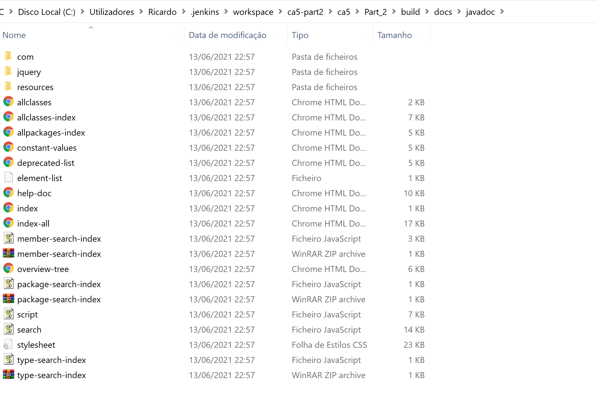

Now it is missing the Html Publish. Let's use the Pipeline Syntax again selecting this task:

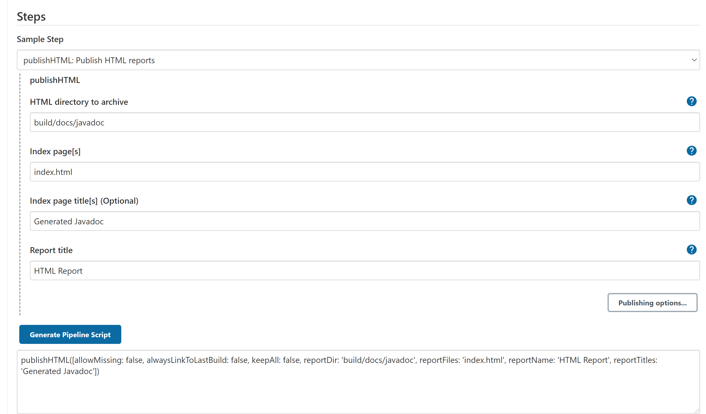

Add this part to the Javadoc stage:

````groovy
stage('Javadoc') {
                    steps{
                        echo 'Generating Javadoc'
                        dir('ca5/Part_2/'){
                        sh './gradlew javadoc'
                        javadoc javadocDir: 'build/docs/javadoc', keepAll: false
                        publishHTML([allowMissing: false, alwaysLinkToLastBuild: false, keepAll: false, 
                        reportDir: 'build/docs/javadoc', reportFiles: 'index.html', reportName: 'HTML Report', reportTitles: 'Generated Javadoc'])
                        }
                    }
                }
````

Now, commit and push (and pray for it to work...).

Well...something is terribly wrong...it worked at the first time...


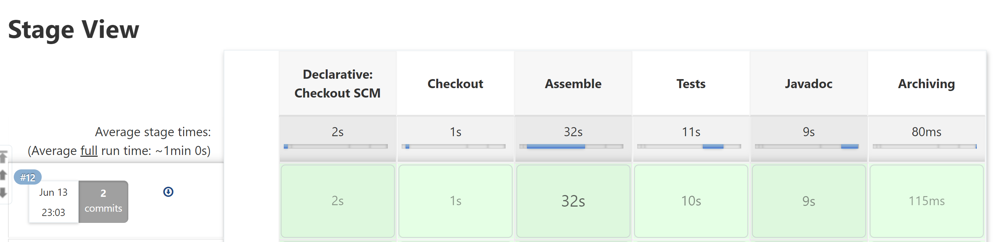

I've even changed one private method to public (I had previously written some Javadoc in this method) in order to verify if it updated the Javadoc in the index Html and it does:

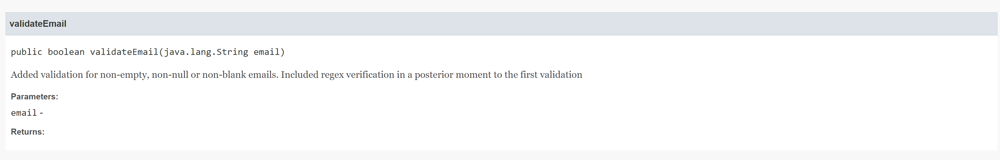

### 2.3 Docker Stage

In this stage, it's required that we generate a Docker image with Tomcat and the war file. Then we should publish it in Docker Hub.

Let's start by verifying if we need any plugin.

It appears that there's some plugins regarding Docker. Let's install them.

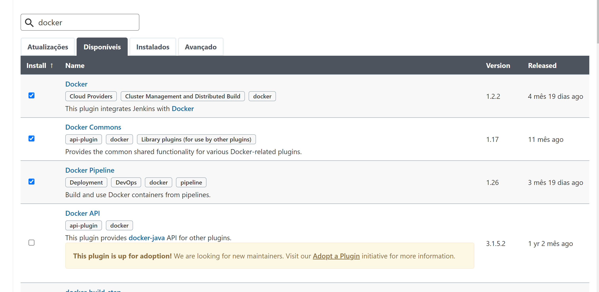

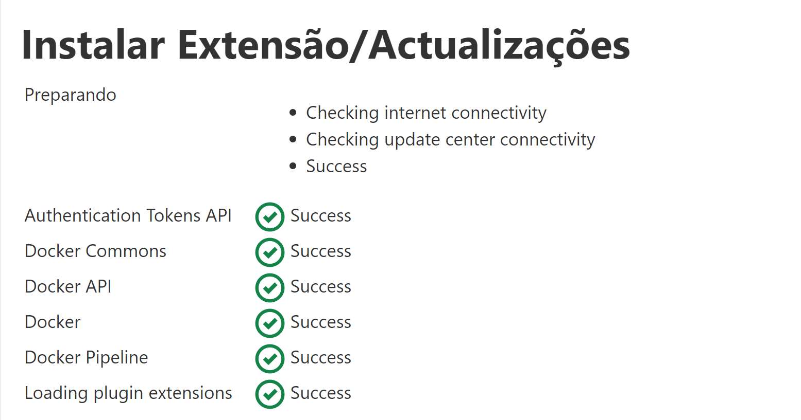

Now, let's get the Web Dockerfile from previous CA4 and edit it and place it inside the Jenkinsfile directory.

After a quick walkthrough, if we want Jenkins to build a Docker Image from a Dockerfile, this last one should be in the same folder of the Jenkinsfile.

After some small changes regarding the war file location, it should look like this:

````dockerfile
FROM tomcat

RUN apt-get update -y

RUN apt-get install -f

RUN apt-get install git -y

RUN apt-get install nodejs -y

RUN apt-get install npm -y

RUN mkdir -p /tmp/build

ADD build/libs/part2-0.0.1-SNAPSHOT.war /usr/local/tomcat/webapps/

EXPOSE 8080
````

Now, let's update the Jenkinsfile:

We should change _agent any_ to _agent {dockerfile true}_ and add the Image build stage:

````groovy
stage('Docker Image') {
                        steps {
                            echo 'Generate Docker Image...'
                            dir('ca5/Part_2/')
                            Ca5_Image = docker.build("ca5-part2-image:${env.BUILD_ID}")
                            Ca5_Image.push()
                            }
                        }
````


Let's commit and push, and then let's try to run the Pipeline.


Well...we failed...and we failed hard, many times.

It appears that the "_agent {Dockerfile true}_" is not a good friend. The solution to overtake this step is removing this and correcting it to _agent any_ just like before.

This time, it almost went fine:

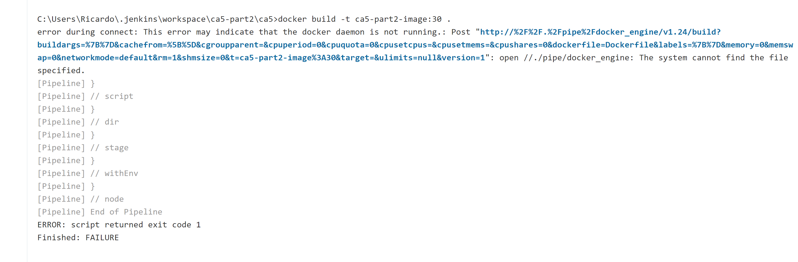


Let's run Docker previously to the build.

It's failing! This time the error seems related to the buildkit:

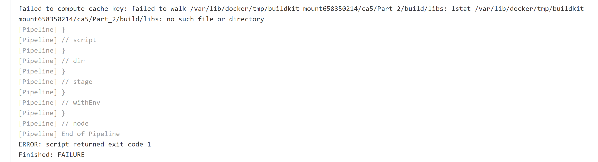

According to our Lord and Savior, the Internet, the buildkit is enabled and it should be disabled.

The easier way is to use the Docker GUI and change it.

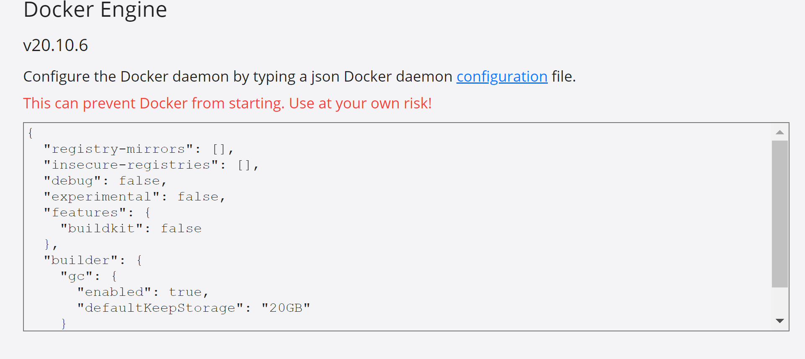

The build still failed a couple of times (Path issues...as usual).

One other mistake is that I was trying to push the image without defining my Docker username.

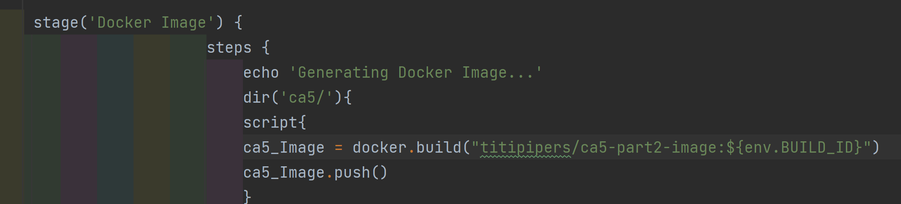

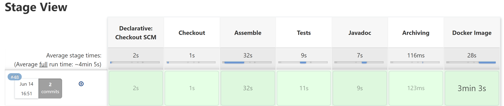

Finally! It's working!!!

CA5-PART2 is done! It was a hard one due to immense troubleshooting! But we've made it! Have a cold one!


